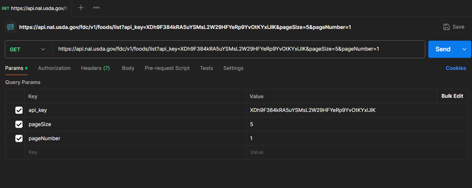
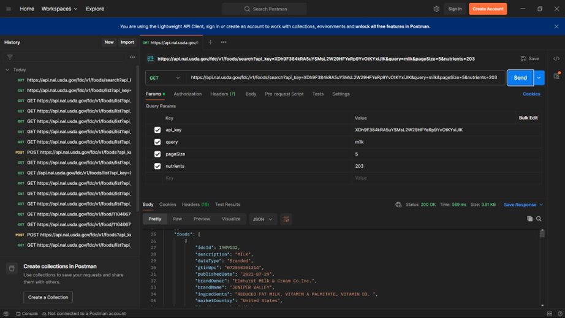
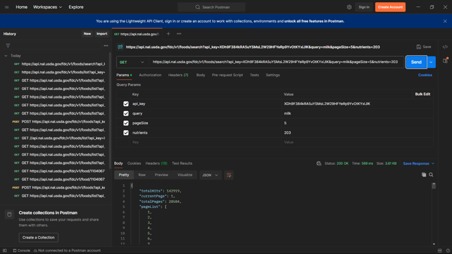
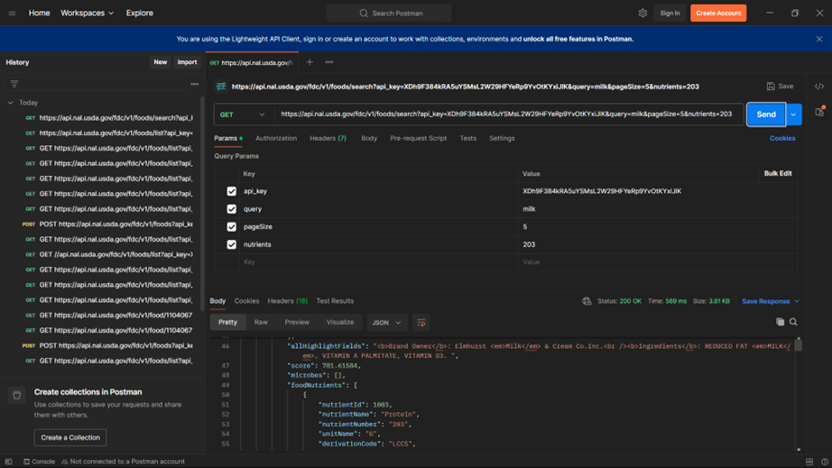

# Investigación de APIs Nutricionales

### INTEGRANTES:
•	RAYMUNDO ALVAREZ MARTINEZ
•	ADRIAN ALEXIS MONREAL ROSAS
### ESCUELA:
•	Cetis 61
### FECHA
•	22/09/25

| API           | Tipo de datos que ofrece | Acceso / Costo | Límites de uso | Facilidad de integración | Documentación disponible |
|----------------|---------------------------|----------------|----------------|---------------------------|---------------------------|
| **USDA** | Nutrientes de alimentos genéricos y de marca, porciones, calorías, macronutrientes (proteínas, grasas, carbohidratos) y micronutrientes (vitaminas, minerales). | Totalmente gratuita. | Tiene límites de solicitudes por minuto y por día, pero son amplios para uso educativo (no suele ser un problema en proyectos). | Moderada. La API es confiable, pero requiere clave (API Key) y conocer un poco de consultas en JSON. | Sí, muy completa y oficial, con ejemplos en su web del USDA. |
| **Nutritionix** | Información nutricional de más de 500,000 alimentos de marcas, restaurantes y alimentos comunes. Incluye calorías, macronutrientes, micronutrientes y hasta datos de menús de cadenas de comida rápida. | Tiene plan gratuito limitado y planes de pago para proyectos más grandes. | En el plan gratuito, aproximadamente 2,000 solicitudes por día. | Alta. Su documentación está pensada para estudiantes y desarrolladores; incluye ejemplos en Python, JavaScript, etc. | Muy completa y clara, con ejemplos de uso en Postman y respuestas JSON. |
| **Edamam** | Información nutricional de ingredientes y recetas, calorías, macronutrientes, micronutrientes, etiquetas de dieta y salud. | Plan gratuito limitado y planes de pago para uso avanzado. | Aproximadamente 10 solicitudes por minuto y 100 por día en el plan gratuito. | Alta. Con endpoints claros y fáciles de usar. | Muy buena, incluye ejemplos de solicitudes y respuestas JSON. |
| **Spoonacular** | Recetas, planes de comida, calorías, macronutrientes, micronutrientes, menús de restaurantes. | Plan gratuito limitado y planes de pago disponibles. | Hasta 150 solicitudes por día en el plan gratuito. | Alta. Endpoints claros y sencillos de implementar. | Muy completa, con ejemplos en varios lenguajes y Postman. |

#### API Elegida: USDA FoodData Central (FDC)
Elegimos esta API ya que es gratuita, no habrá problemas de costos ni límites para nuestro proyecto. También porque tiene datos que provienen del departamento de agricultura de Estados Unidos, esto la hace muy profesional y con datos que respalden.
Tiene datos completos, incluye alimentos genéricos y de marca, con calorías, macronutrientes, proteínas, grasas, carbohidratos, micronutrientes, vitaminas, minerales, y mucho más. Es bastante completa y proporciona miles de datos que ayudan en todo.
Su documentación es clara, en su página web nos explican bien cómo obtener la clave, hacer solicitudes y entender respuestas JSON.
Es muy fácil para principiantes, necesita clave de API, aun así, es más sencilla que otras como “Spoonacular” o “Edamam” en su versión gratuita.
Su soporte de la comunidad, al ser una API reconocida, existen tutoriales, foros y ejemplos en línea que pueden ayudar a todos los usuarios, su comunidad es bastante grande y seguramente encontremos ayuda si tenemos algún problema.
Su uso educativo es ideal, al ser gratuita, confiable y con datos respaldados, es perfecta para practicas de programación y análisis básicos sin necesidad de pagar o tener métodos extremadamente complicados, ahorrando tiempo y dinero, cosa muy valiosa en un estudiante y más de preparatoria

#### Nuestra API Key usada fue:
XDh9F384kRA5uYSMsL2W29HFYeRp9YvOtKYxiJlK (Hecha por USDA)

“https://api.nal.usda.gov/fdc/v1/foods/search?query=banana&api_key=XDh9F384kRA5uYSMsL2W29HFYeRp9YvOtKYxiJlK”
Esta solicitud sirve para buscar un alimento por su nombre, en el ejemplo se usa el alimento banana, y la respuesta es una lista de en qué parte se encuentra ese alimento.

“https://api.nal.usda.gov/fdc/v1/foods/list?api_key=XDh9F384kRA5uYSMsL2W29HFYeRp9YvOtKYxiJlK&pageSize=5&pageNumber=1”
Esta solicitud sirve para traer 5 alimentos de la base de datos con su información básica como nombre, id y tipo de datos. Y se ve así la respuesta:

“https://api.nal.usda.gov/fdc/v1/foods/search?api_key=XDh9F384kRA5uYSMsL2W29HFYeRp9YvOtKYxiJlK&query=milk&pageSize=5&nutrients=203”
Esta solicitud sirve para buscar alimentos que contengan “milk” y que tengan información sobre el nutriente con ID 203 (proteínas). Y las respuestas se ven asi:

#### Dificultades encontradas y soluciones
No hubo muchas dificultades al realizar las pruebas en Postman, solo hubo unas menores como la siguiente, la cual fue un error de escritura y se solucionó investigando como colocarla correctamente
